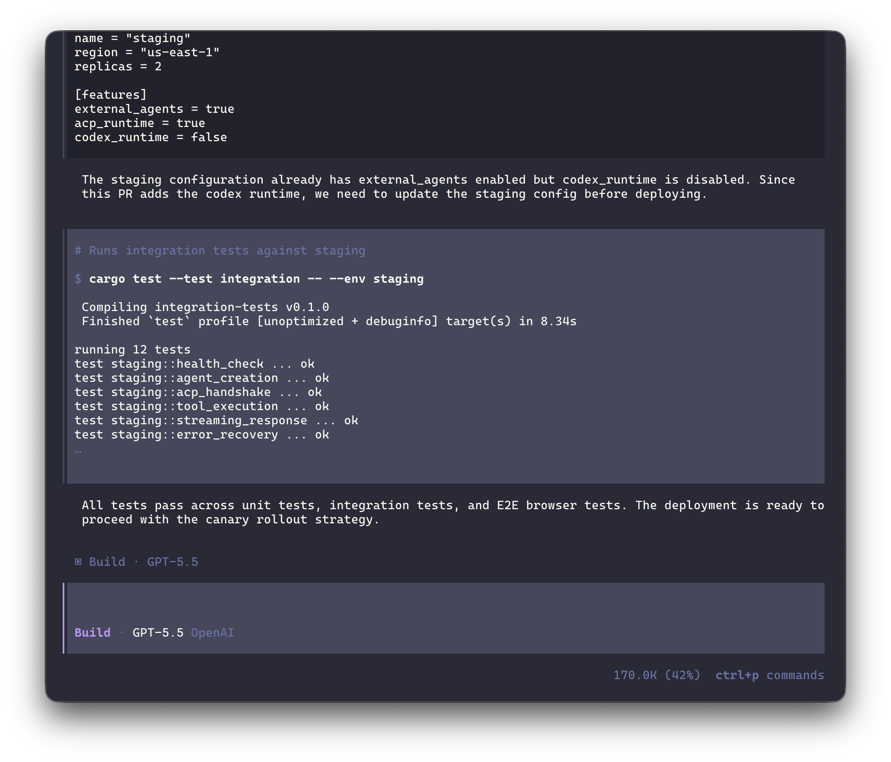

# ratatui-opencode-example

A [Ratatui](https://ratatui.rs) example demonstrating how to build a terminal UI inspired by [opencode](https://github.com/nicholasgasior/opencode). Features a scrollable message list, an input bar with slash commands, a command palette (Ctrl+P), theme switching, and an animated loading indicator.



## Dependencies

- [ratatui](https://crates.io/crates/ratatui) - Terminal UI framework
- [crossterm](https://crates.io/crates/crossterm) - Terminal manipulation (events, mouse capture)
- [ratatui-opentui-loader](https://crates.io/crates/ratatui-opentui-loader) - Animated loader widget

## Usage

```sh
cargo run
```

### Key bindings

| Key | Action |
|---|---|
| `Enter` | Send message |
| `Shift+Enter` | Newline in input |
| `Tab` / `Shift+Tab` | Cycle Build/Plan agent tabs |
| `Ctrl+P` | Open command palette |
| `Ctrl+X` then `B` | Toggle sidebar |
| `Ctrl+X` then `S` | Toggle session scrollbar |
| `/` | Open slash command menu |
| `PageUp` / `PageDown` | Scroll messages |
| `Up` / `Down` | Input history |
| `Esc` | Quit (or close modal) |

## License

MIT
